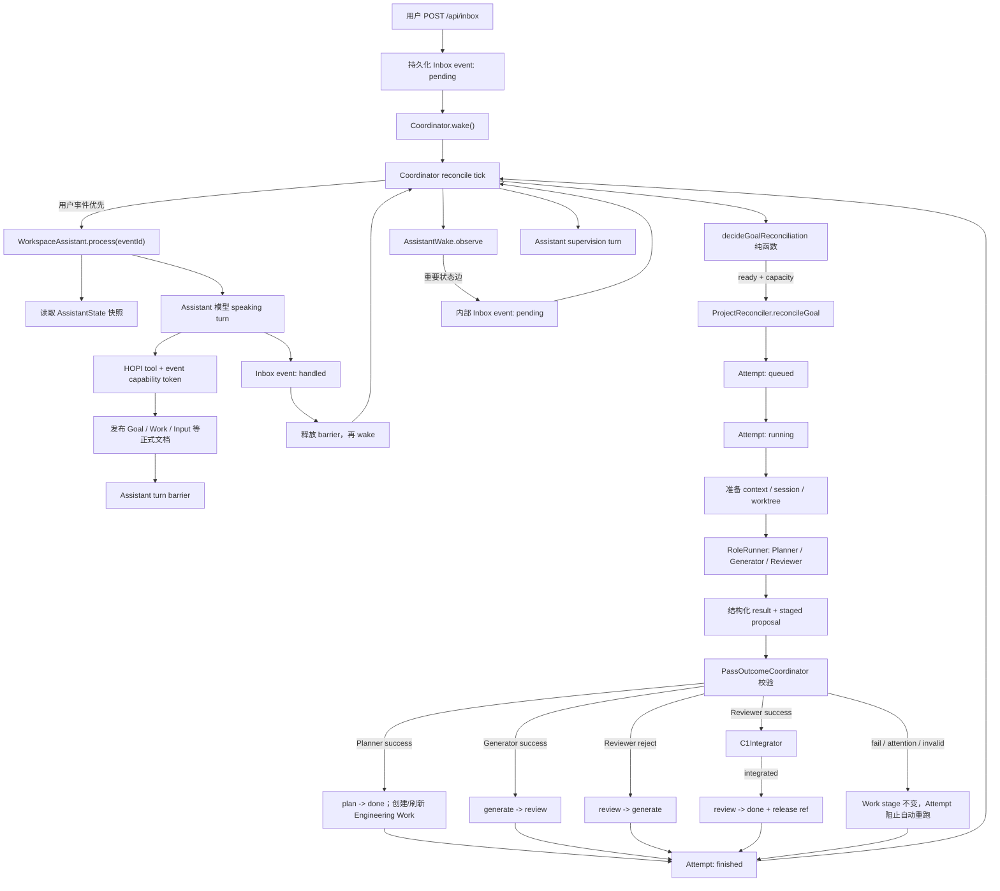
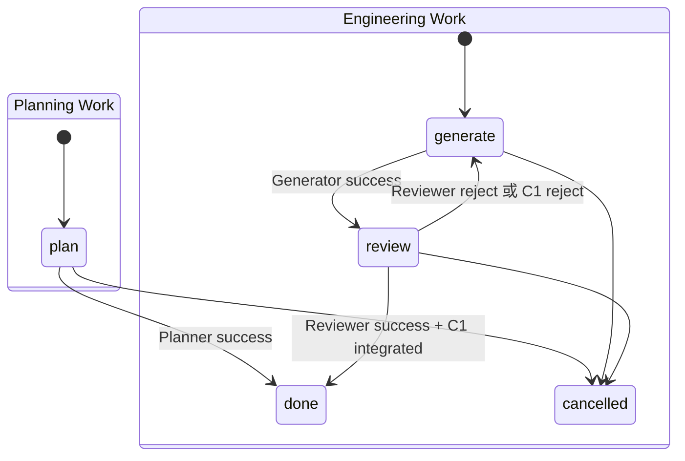

# Hopi 后端核心代码阅读指南

> 范围：只讲生产后端中 `Assistant -> 调度 -> Worker` 的主链路，以及 Goal、Work、Attempt、Inbox 和 Attention 之间的状态流转。E2E Harness、前端、Preview 和普通 HTTP CRUD 不在本文范围内。
>
> 代码基线：2026-08-02 当前工作区。

## 1. 先建立正确的心智模型

项目里没有一个名叫 `Harness` 的总控类。所谓后端 Harness，实际上由下面几个边界清晰的部件拼起来：

| 部件 | 责任 | 不负责什么 |
| --- | --- | --- |
| Assistant | 理解用户意图，充当 Project owner，通过 HOPI tools 创建或调整 Goal/Work | 不直接执行 Engineering Work，不靠回复文本修改状态 |
| CoordinatorReconciler | 全局事件循环、并发容量、挑选可运行 Work、启动 Assistant/Worker | 不理解需求，不决定失败后的业务策略 |
| ProjectReconciler | 执行某个项目中的一次 Planner/Generator/Reviewer Attempt | 不决定跨项目优先级 |
| RoleRunner | 把统一的 Role 输入转换成 Codex/Claude/OpenCode/进程调用，并规范化结果 | 不直接写正式 Goal/Work 文档 |
| PassOutcomeCoordinator | 校验 Worker proposal，并发布允许的状态迁移 | 不执行源码集成 |
| C1Integrator | 将 Reviewer 通过的源码和正式文档合成一个可恢复的 Git 集成边界 | 不做语义评审 |
| AssistantWake | 观察物化状态差异，为重要变化创建内部 Inbox event | 不是 Agent，也不直接做恢复决策 |

因此，`Assistant -> 调度 -> Worker` 不是一次同步函数调用。真实关系是：

1. Assistant 先把意图发布成持久化 Goal/Work；
2. Assistant 当前 speaking turn 完成后，Coordinator 才允许相关 Work 调度；
3. Coordinator 从持久化事实重新计算 readiness；
4. Worker 运行后提交 proposal；
5. Coordinator 侧校验并发布 proposal；
6. 重要状态变化再由 Wake 转成 Assistant 的内部监督事件。

这是一套“持久化状态驱动的 reconciliation loop”，更像 Kubernetes controller，而不是传统的 `assistant.dispatch(worker)` 调用链。

## 2. 一张图看完整主链路



看图时要注意三个异步边界：

- HTTP 入站只保证 Inbox event 已经 durable，不保证 Assistant 已处理；
- Assistant tool 调用完成只保证正式状态已发布，不会在同一 speaking turn 里等待 Worker；
- Worker 进程退出只产生结构化 outcome，正式 Work 状态还要经过 publication/C1。

## 3. 五套状态，各自回答不同问题

这是理解代码最重要的一节。不要把 `running` 塞进 Work，也不要用 Work.stage 猜进程是否还活着。

### 3.1 Goal：业务目标是否仍然有效

定义在 [`canonicalDocuments.ts`](../packages/backend/src/domain/canonicalDocuments.ts#L11)：

```text
active <-> paused
active/paused -> cancelled
active -> done
done/cancelled --reopen--> active + contractRevision++
```

- `active`：允许调度；
- `paused`：保存现状但停止新调度；恢复时先补 Planning Work 重新评估；
- `done`、`cancelled`：终态；
- reopen 不是把旧状态简单改回 active，而是增加 `contractRevision`，让旧版本 Work 自然变 stale。

具体命令由 [`goalController.ts`](../packages/backend/src/runtime/goalController.ts#L324) 执行。

### 3.2 Work：业务交付处于哪个责任阶段

Work 分两种，不存在通用的 `pending/running/failed`：



责任不是额外字段，而是从 `kind + stage` 派生，见 [`softwareDelivery.ts`](../packages/backend/src/runtime/softwareDelivery.ts#L9)：

| Work | 当前责任 |
| --- | --- |
| `planning / plan` | Planner |
| `engineering / generate` | Generator |
| `engineering / review` | Reviewer |
| `done / cancelled` | 无 |

这种设计避免了 `stage=review` 但 `assignedRole=generator` 一类双状态不一致。

### 3.3 Attempt：一次 Worker 执行实例跑到哪了

定义和持久化实现在 [`runAttemptStore.ts`](../packages/backend/src/runtime/runAttemptStore.ts#L19)：

```text
queued -> running -> finished
   |          |
   +----------+-> interrupted
```

Attempt 保存 `runId / responsibility / workHash / execution / result / application`。其中：

- `result` 是 Worker 的语义结果：当前代码实际为 `success | reject | fail`；
- `application` 是 Coordinator 对结果的处理结果，例如 `published`、`attention`、`invalid`、`stale`、`integrated`、`operational_failure`；
- `workHash` 是本次运行所依据的 Work assignment 摘要，用于判断失败是否仍适用于当前 Work。

一次失败只会阻止“内容没有变化的同一 Work”。Assistant 修改消息、时间或依赖后，assignment hash 改变，才可以启动 successor Attempt。判断逻辑在 [`settledAttemptFailure.ts`](../packages/backend/src/runtime/settledAttemptFailure.ts#L7)。

### 3.4 Inbox event：Assistant 的说话/监督任务

```text
pending -> handled
```

用户消息和系统 Wake 都进入同一 Inbox，只是 `source` 和 `visibility` 不同。文件由 [`assistantWorkspaceStore.ts`](../packages/backend/src/storage/assistantWorkspaceStore.ts#L286) 持久化。

每个 Project 同时只能有一个 Assistant conversation scope 在运行；不同 Project 可以并行。用户事件排序优先于内部 Wake，见 [`coordinatorReconciler.ts`](../packages/backend/src/scheduler/coordinatorReconciler.ts#L668)。

### 3.5 Attention：需要 Project owner/用户处理的事实

```text
open(resolvedAt=null) -> resolved
```

Attention 不是 Work 的 `blocked` 字段，也不直接出现在 readiness predicate 里。Worker 新增 Attention 时：

1. Work.stage 保持不变；
2. Attempt.application 记录为 `attention`；
3. 这个 unchanged Work 因 settled Attempt 被暂停自动重跑；
4. Wake 通知 Assistant；
5. Assistant 选择补充信息、修改 Work、取消、或把 Attention 呈现给用户。

这避免了同时维护 `Work.blocked=true`、`Attention.open=true` 和 `Attempt.failed=true` 三套重复事实。

## 4. 哪些数据才是权威状态

| 层 | 典型位置 | 回答的问题 | 是否可重建 |
| --- | --- | --- | --- |
| Canonical Goal package | 项目仓库 `.hopi/docs/goals/<goalId>/` | 目标、交付阶段、输入、证据、Attention 是什么 | 否，业务事实来源 |
| Assistant workspace | Home 下 `.hopi/docs/assistant/inbox/` | 用户/系统事件是否已被 Assistant 处理 | 否，交互事实来源 |
| Attempt runtime | Home 下 `.hopi/runtime/runs/<runId>/attempt.json` | 哪次 Worker 已排队、运行或结束 | 否，运行事实来源 |
| Git release/worktree | `refs/heads/hopi/project/<projectId>/release` 与 task worktree | 哪些源码真正进入项目 release | release ref 是权威；临时工作区可恢复/重建 |
| 内存投影 | `reservations`、`runSlots`、barriers、cache generation | 当前进程如何避免重复启动和并发冲突 | 是 |

重启时不会尝试恢复某个巨大的内存状态机：启动代码会把遗留 `running` Attempt 和 Assistant turn 标记为 interrupted，再从 canonical documents、Attempt manifests 和 Git refs 重建投影。入口在 [`mvpRuntime.ts`](../packages/backend/src/runtime/mvpRuntime.ts#L105)。

## 5. 从用户消息到 Assistant 发布 Goal/Work

### 5.1 HTTP 入站先落盘，再返回 202

从 [`mvpServer.ts`](../packages/backend/src/mvpServer.ts#L446) 开始读：

1. 校验 page context 和 Attention 引用；
2. `workspace.receiveEvent(...)` 创建 `status: pending` 的 Markdown 文档；
3. `publishDurableReceipt(...)` 对文件和父目录执行持久化同步；
4. 成功后调用 `runtime.coordinator.wake()`；
5. 返回 202 和 event ID。

这里的 202 是“事件已经可靠接收”，不是“Assistant 已回答”。它相当于消息队列的 durable enqueue acknowledgement。

### 5.2 Coordinator 总是先消费可运行的 Inbox event

主循环在 [`coordinatorReconciler.ts`](../packages/backend/src/scheduler/coordinatorReconciler.ts#L329)。一个 tick 开始时先找 eligible pending event：

- 同一 Project scope 已有 Assistant turn 时不再启动第二个；
- 用户事件排在 system event 前；
- 选中后用 `AbortController` 管理 turn 生命周期；
- Assistant turn 结束时释放 barrier 并再次 wake。

只有当前没有 eligible Inbox event，才进入 Worker settlement 观察和 Work 调度。

### 5.3 WorkspaceAssistant 运行模型，但只给它能力令牌

[`workspaceAssistant.ts`](../packages/backend/src/assistant/workspaceAssistant.ts#L461) 的 `process(eventId)` 做这些事：

1. 读取 durable Inbox event；
2. 按 home/project 选择持久会话；
3. 读取 AssistantState 快照；
4. 为当前 event 签发临时 tool token；
5. 运行模型；内部 Wake 尽量 fork 既有 speaking session；
6. 将回复和 disposition 写回 Inbox，状态变为 handled；
7. revoke token，通知 turn settled。

执行边界显式声明为 `canonicalMutation: 'hopi-tools-only'`。也就是说：

- Assistant 回复中写“我创建了 Work”没有控制效果；
- 只有携带当前 event token 的 HOPI tool 能改正式状态；
- token 只映射到一个 eventId，turn 结束立即失效。

令牌薄封装在 [`assistantTools.ts`](../packages/backend/src/assistant/assistantTools.ts#L14)，真正的工具语义在 [`assistantToolExecutor.ts`](../packages/backend/src/assistant/assistantToolExecutor.ts#L316)。

### 5.4 Assistant turn barrier 防止“边说边开工”

`hopi_create_goal`、`hopi_create_work` 或 control tool 在改 Goal 前，会调用 `onGoalEffect(eventId, projectId, goalId)`。它最终进入 [`coordinatorReconciler.ts`](../packages/backend/src/scheduler/coordinatorReconciler.ts#L203) 的 `assistantTurnBarriers`。

barrier 的意义是：Assistant 可能连续调用多个工具组成一次语义操作；在它最终回复和 Inbox handled 尚未落盘前，Coordinator 不启动刚刚创建或修改的 Work。否则用户可能还没收到“已创建”，Generator 已经基于中间状态运行。

barrier 只在内存中存在是有意的：真正需要恢复的 tool effect 和 pending/handled event 已经持久化，重启后可以从这些事实重新协调。

## 6. 调度器怎样决定下一位 Worker

### 6.1 纯决策层：先算投影，再选一个动作

先读 [`workProjection.ts`](../packages/backend/src/domain/workProjection.ts#L24)。一个 Work ready 必须同时满足：

- Work 非终态；
- Goal 为 active；
- Project eligible；
- Work.contractRevision 等于 Goal.contractRevision；
- 所有 `dependsOn` Work 都为 done；
- `notBefore` 已到；
- unchanged Work 没有 settled failure；
- 没有 live/queued Attempt；
- 对应责任还有全局容量；
- 当前 kind/stage 能派生出 responsibility。

再读 [`reconcileDecision.ts`](../packages/backend/src/scheduler/reconcileDecision.ts#L22)：

1. cancelled Goal 还有非终态 Work：`finish_cancellation`；
2. active Goal 没有非终态 Work：`ensure_planning`；
3. 有 ready Work：`dispatch`；
4. 否则 `wait`，并返回失败谓词。

`ensure_planning` 很关键：Engineering Work 全部 done 并不直接完成 Goal。Coordinator 会创建一次最终 Planning Work，让 Planner 做语义收尾；只有 Planner 确认没有非终态 Engineering Work，才发布 Goal done。

### 6.2 全局 Coordinator：处理公平性、容量和副作用

[`coordinatorReconciler.ts`](../packages/backend/src/scheduler/coordinatorReconciler.ts#L379) 扫描所有 Project/Goal 后：

- Goal 先按 priority 降序，再按 projectId/goalId 稳定排序；
- Goal 内 Planner 优先于 Engineering，随后按依赖深度和 Work ID 排序；
- 全局默认容量来自 [`softwareDelivery.ts`](../packages/backend/src/runtime/softwareDelivery.ts#L3)：Planner 3、Generator 5、Reviewer 3；
- `reservations` 防止同一 Work 在多个 tick 重复启动；
- `notBefore` 用 deadline timer 唤醒，不做固定频率轮询；
- loop 是 edge-triggered：入站、发布、run 完成、topology 变化触发 wake，并把多次 wake 合并成后续 tick。

`CoordinatorReconciler` 是全局控制面；不要从 `ProjectReconciler` 里寻找跨项目优先级。

### 6.3 两个容易漏掉的调度屏障

除了 Assistant turn barrier，还有 `projectsAwaitingSettlementObservation`：

- Planner 每次结束后；
- Reviewer reject 后；

Coordinator 会先让 Wake 观察到这条状态边，再允许该 Project 继续派发。原因是这两种结果往往需要 Assistant 做 Project-owner 级监督。普通的 Generator success `generate -> review` 不经过 Assistant，Reviewer 可以直接接棒。

## 7. ProjectReconciler 怎样执行一次 Worker

主文件是 [`projectReconciler.ts`](../packages/backend/src/scheduler/projectReconciler.ts#L128)。建议把 `reconcileGoal` 按下面九段读，不要试图一次吞完整个大函数。

### 7.1 重新读取正式状态并淘汰旧 queued Attempt

运行前重新读 GoalPackage。若 queued Attempt 的 Work 已终态、责任已变化或 `workHash` 不匹配，则把它标为 interrupted。这样“队列中的旧任务”不能覆盖新指令。

### 7.2 reserve，再 start

`attempts.reserve` 先创建 `queued` manifest；真正拿到 `runSlot` 后，`attempts.start` 才改成 `running`。同一责任下，相同 hash 的 queued 请求幂等返回 `already_scheduled`，已有 running 则返回 `already_active`。

这里有两层防重：

- durable Attempt index：跨 reconcile 调用、支持重启审计；
- 内存 `runSlots`：持有当前 `AbortController` 和活进程所有权。

### 7.3 为不同 Role 准备不同隔离环境

- Planner：读取 release 上的项目事实，不需要 task worktree；
- Generator：使用稳定 task worktree，可以延续前次部分源码；
- Reviewer：使用从受控基线准备的 clean worktree，并在 RoleRunner 前后做源码指纹校验，禁止 Reviewer 改代码。

Worker 上下文由 [`roleContextStager.ts`](../packages/backend/src/runtime/roleContextStager.ts#L128) 生成。它冻结当前 Goal/Work、哈希 guard、prompt、proposal root 和 result file。Generator/Reviewer 运行前还会经过 Project prepare adapter。

### 7.4 Responsibility session 与 Attempt 不是同一个概念

[`responsibilitySessionStore.ts`](../packages/backend/src/runtime/responsibilitySessionStore.ts#L80) 保存某个 `project/goal/work/responsibility` 的 vendor session 和可复用 scratch workspace。它用于上下文连续性。

Attempt 则是一次可审计执行。一个 session 可以跨多个 Attempt 继续，但 assignment hash、contract revision 或 runtime digest 改变时会开启新的执行边界。

### 7.5 RoleRunner 是统一适配器，不是三个 Worker 类

[`RoleRunner.ts`](../packages/backend/src/agent/RoleRunner.ts#L93) 根据 responsibility 选择配置并启动 vendor 进程：

- 转录标准化为统一 runtime events；
- 心跳保持活性诊断；
- 使用 process group terminator 和 AbortSignal 中断子进程树；
- 解析结构化 result file；
- Planner 不允许 reject，Generator 不允许 reject，Reviewer 可 success/reject/fail；
- Reviewer 如果改了 task worktree，结果强制变 fail；
- Worker 如果直接改 canonical `.hopi` 内容，结果强制变 fail。

所以 Planner、Generator、Reviewer 的差异主要来自责任、prompt、工作目录、权限和结果约束，而不是三套长期驻留的类。

### 7.6 Generator 先 checkpoint，结果再发布

Generator 运行结束后，源码先 checkpoint 到 task worktree。即使被中断，系统也尽力保留安全的部分源码。之后 artifacts 被搬到受控 run 目录，防止结果引用临时或 release 外路径。

### 7.7 PassOutcomeCoordinator 校验 proposal

[`passOutcomeCoordinator.ts`](../packages/backend/src/runtime/passOutcomeCoordinator.ts#L60) 不信任 Worker 自报结果。它会：

1. 读取 staged proposal 与运行前 authority file hashes；
2. 限制 proposal 路径和 Role 权限；
3. 验证 Goal/Work 仍是本次运行看到的 revision/stage/hash；
4. 生成 Evidence；
5. 构造唯一允许的状态迁移；
6. 交给 GoalPackageStore 发布。

Worker outcome 与正式状态的对应关系：

| Role outcome | Work/Goal 变化 | 后续行为 |
| --- | --- | --- |
| Planner success，有非终态 Engineering | Planning `plan -> done`，可创建/刷新 `generate` Work | Coordinator 继续调度 Engineering |
| 最终 Planner success，无非终态 Engineering | Planning `plan -> done`，Goal `active -> done` | Wake Assistant |
| Planner fail | stage 保持 `plan`，附 Evidence | unchanged Work 停止自动重跑，Wake Assistant |
| Generator success | `generate -> review` | 直接调度 Reviewer，通常不 Wake Assistant |
| Generator fail | stage 保持 `generate`，附 Evidence | unchanged Work 停止自动重跑，Wake Assistant |
| Reviewer reject | `review -> generate` | 先 Wake Assistant，再允许下一轮 Generator |
| Reviewer success | 暂不直接发布 done | 进入 C1 集成 |
| Reviewer fail | stage 保持 `review`，附 Evidence | unchanged Work 停止自动重跑，Wake Assistant |
| 任意 Role 新建 Attention | stage 保持不变，发布 Attention + Evidence | Attempt.application=`attention`，Wake Assistant |
| proposal invalid | 不接受 proposal | unchanged Work 停止自动重跑 |
| proposal stale | 丢弃旧结果 | 以最新 Work authority 重新计算；不是盲目覆盖 |

### 7.8 PublicationCoordinator 提供文件系统版 CAS

正式写入都经过 [`publisher.ts`](../packages/backend/src/publication/publisher.ts#L21)：

- 进程内 Promise mutex 串行化 publication；
- 每个 write 携带 `expectedHash`，类似 HTTP `If-Match`/数据库 optimistic lock；
- 先在 overlay candidate 上跑完整 schema/transition validation；
- supporting writes 先写，最后写 gate document；
- 单文件通过“临时文件 + rename”原子替换；
- 最后再验证每个文件的 SHA-256 postcondition。

底层上，`rename` 在同一文件系统内提供原子名称切换，读者不会看到半个 Markdown 文件；`expectedHash` 防止两个基于旧快照的写入静默互相覆盖。它不等于数据库的多行 ACID 事务，所以项目额外使用 gate write 和可重放校验把多文件发布组织成一个可识别边界。

### 7.9 Reviewer success 必须经过 C1

Reviewer success 在 PassOutcomeCoordinator 中只返回 `integration_required`。真正的 `review -> done` 在 [`c1Integrator.ts`](../packages/backend/src/runtime/c1Integrator.ts#L77) 中完成：

1. 在 publication exclusive section 内重新验证 semantic guard；
2. 构造源码集成候选；
3. 将 Evidence、completed Work 和源码写进同一个 C1 commit；
4. 原子推进 Project release ref；
5. 恢复/刷新工作区投影。

如果确定性 merge/preflight 拒绝，系统把结果转成 Reviewer reject，Work 回到 generate。若已经跨过 release-ref 边界后物化失败，则返回 `blocked_after_boundary`，保留 commit 供恢复，不能假装回滚成未发生。

## 8. Wake 怎样把 Worker 结果送回 Assistant

[`assistantWake.ts`](../packages/backend/src/assistant/assistantWake.ts#L103) 是确定性 observer：

1. 读取 AssistantState 的 project/home scope 快照；
2. 与每个 scope 的 cursor digest 比较；
3. 无重要变化则只更新/保持 baseline；
4. 有重要变化则创建 `EV-wake-*` 内部 Inbox event；
5. Coordinator 再启动同一 Project 的 Assistant supervision turn。

即时重要信号包括：

- Planner 已发布结果；
- Reviewer reject；
- settled failure；
- stale run；
- unresolved Attention 且当前无 active run；
- Project unavailable；
- Goal 完成或其他物化状态差异（settled 时观察）。

Assistant 的内部 turn 可以：

- 静默处理，不打扰用户；
- 调 HOPI tools 修改/继续/取消 Work；
- 创建或解决 Attention；
- 将完整 Attention 引用公开给用户；
- 给用户发送状态通知。

Wake 自己不会解释失败，也不会写“自动重试三次”之类策略。这使失败恢复仍由 Project owner 的上下文判断控制。

## 9. 完整 happy path：从一句需求到 Goal done

假设用户说“给 API 增加导出功能”：

1. `/api/inbox` 持久化 `EV-1 pending`，wake Coordinator；
2. Coordinator 发现用户 event，启动 Assistant；
3. Assistant 调 `hopi_create_goal`，发布 `G-export active` 和 `W-plan plan`，安装 barrier；
4. Assistant 回复落盘，`EV-1 handled`，barrier 释放；
5. Coordinator 投影出 `W-plan -> planner` ready，创建 `R-1 queued -> running`；
6. Planner proposal 创建 `W-api generate`，并把 `W-plan -> done`；
7. Planner settlement 先触发 Assistant supervision；若无新决策，Coordinator 继续；
8. Generator 在 task worktree 改源码，`R-2` success，发布 `W-api generate -> review`；
9. 不经过 Assistant，Coordinator 直接启动 Reviewer；
10. Reviewer success 后进入 C1，源码 + Evidence + `W-api done` 进入 release commit；
11. Coordinator 发现 Goal 内已无非终态 Work，自动创建最终 `W-plan-2 plan`；
12. Planner 做完成性评估，发布 `W-plan-2 done` 和 `G-export done`；
13. Wake 创建内部 Inbox event，Assistant 生成最终对用户可见的完成说明。

这里没有任何 `while (workerRunning) poll()`。每个 durable publication 或 run settlement 都触发下一次 reconciliation。

## 10. 失败路径应该怎样读

### 10.1 Worker fail 不是 Work.stage=`failed`

Work 保持原 stage，Attempt 记录失败。readiness 投影看到“最新失败 Attempt 的 workHash 仍等于当前 assignment hash”，给出 `failed_attempt`。Assistant 必须明确选择：

- 用 `continue` 加消息或调整调度，形成新 assignment；
- 修改依赖/设计/contract revision；
- 取消 Work/Goal；
- 请求用户 Attention。

系统故意不做 unchanged Work 的隐式重试，因为同样的输入、同样的责任、同样的环境通常只会稳定复现同一失败。

### 10.2 stale 与 fail 不一样

stale 表示 Worker 基于旧 authority 完成，publication 的 expected hash/semantic guard 已失效。旧结果被丢弃，但当前 Work 可能已经有新 assignment，可以按最新状态继续调度。

fail 表示对当前 unchanged assignment 的有效失败，会暂停自动重跑。

### 10.3 Project blocked 与 Work 等待不一样

C1 完整性问题、release ref 漂移或项目结构校验失败可能让整个 Project 变为 ineligible。Coordinator 从 eligible set 移除它并发布 Project system event。此时不是某个 Work 的业务阻塞，而是控制面不能安全相信项目边界。

## 11. 并发与一致性：从底层机制理解

| 问题 | 使用的机制 | 为什么需要 |
| --- | --- | --- |
| 多次 wake 同时到达 | `wakePending + reconciling Promise` 合并边沿 | 避免重复扫描和递归调用栈 |
| 同一 Project 的 Assistant 并发说话 | conversation scope key + `assistantActive` | 保持对话和 owner 决策有序 |
| Assistant tool 尚未说完，Worker 抢跑 | assistant turn barrier | 防止读取中间业务状态 |
| 同一 Work 重复启动 | durable Attempt reserve + 内存 reservation/runSlot | 同时覆盖重启审计和活进程所有权 |
| 多个 Worker 并发改正式文档 | publication Promise mutex | 让 candidate validation 与写入串行 |
| 基于旧快照覆盖新状态 | SHA-256 `expectedHash` CAS | 检测 lost update |
| 写文件中途崩溃 | 临时文件 + atomic rename；gate write | 防止半文件，并标识多文件发布是否完成 |
| 停止/暂停/重绑项目 | AbortController + process group termination | 同时通知 JS 调用链和整个子进程树 |
| Reviewer 通过但源码未进 release | C1 commit + release ref 边界 | 把“代码完成”和“状态 done”绑定 |

如果你熟悉前端，可以把纯 `decideGoalReconciliation` 类比为 selector，把 `CoordinatorReconciler` 类比为 effect runtime；但 canonical files 不是 Redux cache，而是服务重启后仍然成立的事实来源。

## 12. 推荐阅读顺序

### 第一轮：30 分钟，只建立骨架

1. [`mvp_state_machine.md`](./mvp_state_machine.md)：先记住五套状态；
2. [`mvpRuntime.ts`](../packages/backend/src/runtime/mvpRuntime.ts#L105)：看依赖如何组装；
3. [`coordinatorReconciler.ts`](../packages/backend/src/scheduler/coordinatorReconciler.ts#L329)：只读 `reconcileTick`；
4. [`reconcileDecision.ts`](../packages/backend/src/scheduler/reconcileDecision.ts#L22) 和 [`workProjection.ts`](../packages/backend/src/domain/workProjection.ts#L24)：理解 readiness；
5. [`projectReconciler.ts`](../packages/backend/src/scheduler/projectReconciler.ts#L265)：沿一次 Attempt 往下走；
6. [`passOutcomeCoordinator.ts`](../packages/backend/src/runtime/passOutcomeCoordinator.ts#L60)：看 stage 真正在哪里迁移。

读完应该能回答：当前 Work 为什么轮到 Planner/Generator/Reviewer，以及为什么它此刻不能运行。

### 第二轮：60 分钟，追一条真实调用链

1. [`mvpServer.ts`](../packages/backend/src/mvpServer.ts#L446)：Inbox 入站；
2. [`assistantWorkspaceStore.ts`](../packages/backend/src/storage/assistantWorkspaceStore.ts#L286)：durable receipt；
3. [`workspaceAssistant.ts`](../packages/backend/src/assistant/workspaceAssistant.ts#L461)：Assistant turn；
4. [`assistantToolExecutor.ts`](../packages/backend/src/assistant/assistantToolExecutor.ts#L483)：创建 Goal/Work；
5. [`goalController.ts`](../packages/backend/src/runtime/goalController.ts#L73)：受控业务变更；
6. [`runAttemptStore.ts`](../packages/backend/src/runtime/runAttemptStore.ts#L221)：Attempt manifest；
7. [`roleContextStager.ts`](../packages/backend/src/runtime/roleContextStager.ts#L128)：Worker 看到什么；
8. [`RoleRunner.ts`](../packages/backend/src/agent/RoleRunner.ts#L93)：模型进程怎样运行；
9. [`publisher.ts`](../packages/backend/src/publication/publisher.ts#L248)：结果怎样原子发布；
10. [`c1Integrator.ts`](../packages/backend/src/runtime/c1Integrator.ts#L77)：Reviewer success 怎样真正 done；
11. [`assistantWake.ts`](../packages/backend/src/assistant/assistantWake.ts#L103)：状态怎样回到 Assistant。

### 第三轮：用测试验证理解

按概念而不是按文件体积读：

```bash
bun test \
  packages/backend/tests/workProjection.test.ts \
  packages/backend/tests/reconcileDecision.test.ts \
  packages/backend/tests/runAttemptStore.test.ts \
  packages/backend/tests/passOutcomeCoordinator.test.ts \
  packages/backend/tests/projectReconciler.test.ts \
  packages/backend/tests/coordinatorReconciler.test.ts \
  packages/backend/tests/workspaceAssistant.test.ts \
  packages/backend/tests/assistantWake.test.ts
```

建议先在测试里搜索以下场景：

- `failed_attempt`：为什么 unchanged Work 不重跑；
- `reviewer reject`：为什么先 Wake 再回 Generator；
- `assistant barrier`：为什么 tool effect 后不能立刻 dispatch；
- `stale`：旧 proposal 为什么不能覆盖新 Work；
- `integration_required`：为什么 Reviewer success 不等于 done；
- `restart/interrupted`：哪些内存状态可丢弃。

## 13. 调试一个真实 Run 时看哪里

按这个顺序定位，通常不需要先看日志大海：

1. `.hopi/docs/assistant/inbox/<eventId>.md`：Assistant 输入是否 pending/handled、用了什么 disposition；
2. `.hopi/docs/goals/<goalId>/goal.md`：Goal lifecycle 和 contractRevision；
3. `.hopi/docs/goals/<goalId>/work/<workId>.md`：kind/stage/dependsOn/notBefore/evidenceRefs；
4. `.hopi/runtime/runs/<runId>/attempt.json`：Attempt status/result/application/workHash；
5. 同一 run 目录下 `events.jsonl`、`prompt.md`、`transcript.log`、result/proposal：Worker 实际看到了什么、返回了什么；
6. Goal 下 `evidence/` 与 `attention/`：结果是否被正式消费；
7. `git log refs/heads/hopi/project/<projectId>/release`：Reviewer 通过的源码是否真的跨过 C1。

快速判断规则：

- Work 还是 generate，Attempt finished/fail：不是“调度器没改状态”，而是有意保持 stage 并等待 Assistant；
- Work 已 review，没有 Reviewer Attempt：检查 capacity、live run、project eligibility 和 barrier；
- Reviewer success 但 Work 未 done：检查 Attempt.application 和 C1 结果；
- 内部 Wake event pending：Coordinator 会优先跑 Assistant，该 Project 的 Worker 暂时不应抢跑。

## 14. 当前实现中值得警惕的点

### 14.1 设计文档与返回枚举有一处表达差异

[`mvp_state_machine.md`](./mvp_state_machine.md#attempt) 把责任结果概括为 `success | reject | attention | fail`；当前 [`RoleRunner.ts`](../packages/backend/src/agent/RoleRunner.ts#L27) 的结果 schema 实际只有 `success | reject | fail`。

当前代码里的 attention 是“Worker 在 proposal 中新增 targeted Attention document”，然后 `PassOutcomeCoordinator` 返回 `application.kind = attention`。阅读代码时不要寻找 `outcome.result === 'attention'` 分支。

### 14.2 两个大 Reconciler 是主要复杂度集中点

- `CoordinatorReconciler` 同时承担全局 loop、Assistant 调度、容量、barrier、Wake settlement；
- `ProjectReconciler.reconcileGoal` 同时承担 Attempt 生命周期、环境准备、RoleRunner、artifact、publication、C1。

它们目前仍把纯决策分别抽到了 `reconcileDecision/workProjection`，把落盘与集成抽到了独立组件，这是保持可测试性的关键。未来若继续增长，长期方向应该是按“可恢复执行阶段”拆分，而不是增加更多布尔状态或特判。

### 14.3 `isAttentionBlocking` 这个名字容易误导

canonical domain 中有 `isAttentionBlocking`，但 Scheduler readiness 并不直接读取 Attention。真正暂停 unchanged Work 的是 settled Attempt application。理解行为应以 `workProjection.ts` 和 `settledAttemptFailure.ts` 为准，而不是从函数名推断全局调度语义。

## 15. 读完后应能回答的十个问题

1. Assistant 为什么不能通过自然语言回复直接改 Goal？
2. 为什么创建 Work 后要等 Assistant speaking turn 结束才调度？
3. Work.stage 和 Attempt.status 分别是谁的状态？
4. 当前责任为什么不需要持久化 assignedRole？
5. Generator success 后为什么通常不唤醒 Assistant？
6. Reviewer success 为什么仍然可能没有 done？
7. Worker fail 后为什么不自动重试相同 Work？
8. stale proposal 为什么不会覆盖更新后的 Work？
9. 服务重启后哪些事实能重建 `reservations/runSlots`？
10. Goal 中所有 Engineering Work done 后，为什么还要再跑一次 Planner？

如果这十题都能沿文件位置回答，你已经掌握了 Hopi 后端核心控制面的实现，而不是只记住了一张流程图。
