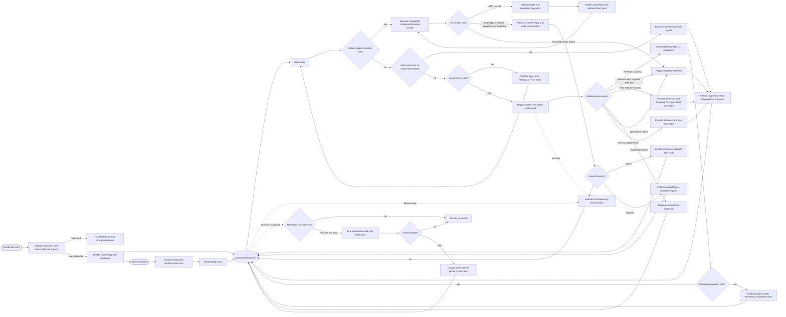
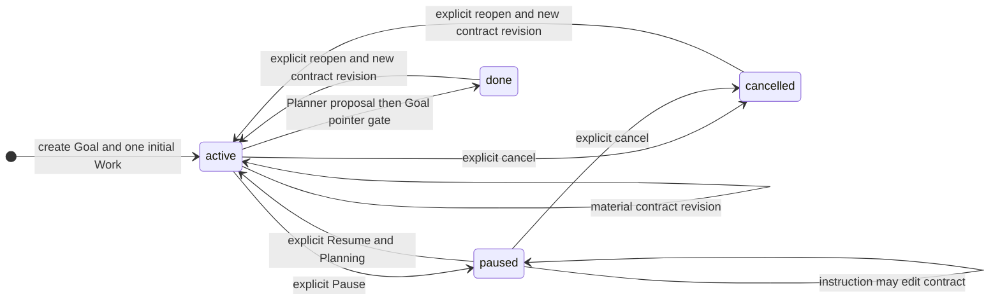

# HOPI MVP State Machine

Status: accepted derived reference
Last updated: 2026-07-23

This document visualizes the lifecycle rules accepted in [the MVP design](./mvp_design.md). It is
not a second source of truth. Schemas belong to [the document model](./mvp_document_model.md),
Assistant behavior to [the Assistant design](./mvp_assistant.md), execution behavior to
[the execution design](./mvp_execution.md), and publication mechanics to
[the publish protocol ADR](./mvp_publish_protocol.md).

## Product and Durable State

The operator-facing product has **Assistant**, **Project**, and **Goal**. Project is stable context
without a workflow lifecycle. Attention is an internal control document. Targeted Attention blocks
its target and projects as **Waiting for Assistant** or **Needs you** from its explicit current
operator-request pointer; delivery alone never transfers ownership to the operator. Targetless
Attention is readable legacy completion state. New completion updates derive from final Planning
Evidence. Attention is not another product concept.

Five internal document types have these minimal durable control fields:

| Entity           | Durable discriminator | Values                                     |
| ---------------- | --------------------- | ------------------------------------------ |
| Goal             | `lifecycle`           | `active \| paused \| done \| cancelled`    |
| Planning Work    | `stage`               | `plan \| done \| cancelled`                |
| Engineering Work | `stage`               | `generate \| review \| done \| cancelled`  |
| Attention        | `resolvedAt`          | `null` while open; timestamp when resolved |
| Inbox turn       | `status`              | `pending \| handled`                       |

Work also stores `kind`, permanent `dependsOn`, `notBefore`, `contractRevision`, top-level
`attempts: 0`, and append-only `evidenceRefs`. Failure context is read from referenced immutable
Evidence. These are control facts,
not additional states. A Run, process, lease, Repo projection, root eligibility, and Kanban badge are
runtime facts or derived projections. `running`, `queued`, `scheduled`, and `waiting` are not Work
stages.

Run records and processes are disposable, but a `runId` is never reused within its Work. Evidence
and Git may retain qualified producer identity `(projectId, goalId, workId, runId)` after runtime
cleanup.

Inbox `source: user | reflection` and `visibility: public | internal` are provenance and projection
facts, not more status values. Reflection itself has no canonical lifecycle. Its runtime manifest is
disposable; only a useful internal brief enters the ordinary Inbox state machine.

A direct product control can hold a process-local admission guard while it deterministically moves
its receipt from `pending` to `handled`. Eligibility ignores that receipt during the guard; the
receipt itself has no extra state, and after a crash it is eligible as normal pending input.

Pass results are `success | reject | attention | fail`. Prose explains a result but cannot invent a
transition. An invalid proposal is an application result, while provider, process, and infrastructure
failure is a runtime fact; neither is rewritten into semantic `fail`. If the Coordinator or runner
process disappears before a Work gate is published, no result is consumed and `attempts` may remain
unchanged.

Stable identity is explicit: event `(homeId, eventId)`, Goal `(projectId, goalId)`, Work
`(projectId, goalId, workId)`, producer Run `(projectId, goalId, workId, runId)`, Goal-local
Attention `(projectId, goalId, attentionId)`, and workspace Attention `(homeId, attentionId)`.
Each Assistant-home project link retains expected `{ projectId, primaryRepoId, repos }`, where every
Repo owns a stable ID and local path. Agent model settings are Home-wide configuration and are not
Project or lifecycle state. The selected checkout only locates the Repo and initial HEAD; it is
never a canonical or delivery root. Coordinator derives Project-qualified Repo-adjacent stable
integration and task worktrees. A missing, corrupt, or divergent managed projection is blocked
under the expected binding identity.

## Publication Boundary

All canonical mutations use `publish(bundle)` under one Coordinator and one global publication
mutex. One ordinary publication changes exactly one storage root and has one shape:

```text
validate complete candidate -> supporting writes -> optional single domain gate
```

Supporting writes may include documents, source checkpoints, artifacts, and Evidence. A domain
gate is one authoritative write that changes eligibility or claims consumption or completion, such
as an Inbox `handled` update, Goal Input receipt, Planning Work guard, Work transition, Attention
resolution, or Goal terminal transition. If an operation needs more than one gate or storage root,
Coordinator splits it into ordered publications. A process stop may leave an earlier publication
complete, but never makes a later gate appear first.

`C1` integration is an independent Git operation rather than an ordinary multi-file publication.
Its guarded target-ref move is the single irreversible gate, and integration is reported successful
only after that ref is durable. Implementation ordering, atomic file replacement, and Git mechanics
are specified only in the publish protocol ADR.

The ordinary document protocol targets process-crash recovery, not general power-loss durability.
Two boundaries are stronger:

- an Inbox turn is durably stored before HOPI acknowledges receipt to its sender
- `C1` objects and target ref are durable before integration is reported complete

Model calls, pass Runs, tests, and task-worktree edits happen outside the mutex. Snapshot capture
and publication are serialized, not execution. A mutating HOPI tool uses ordered idempotent
project effects and Goal Input, then the final Assistant reply handles the Assistant-home turn.

Each pass receives a staged immutable context bundle from the current managed root. The task
worktree may not contain later uncheckpointed canonical documents; its source checkout is never
used as workflow authority. Returning output must still pass the current canonical guards.

Before enabling Inbox, reconciliation, delivery, or dispatch, Coordinator validates Assistant home
and every configured project. It discards stale runtime leases and reruns unconsumed work rather
than attaching old processes. An ambiguous or unwritable project gets one open project-target
Attention in Assistant home and remains unscheduled. If Assistant home itself cannot be validated
or written, startup fails closed and an external supervisor alerts the operator.

If a durable C1 ref exists but a managed integration projection is missing, partial, or inconsistent,
HOPI creates or reuses project-target Attention and keeps the Project unscheduled. Managed ownership
does not make canonical documents disposable, so the MVP performs no destructive repair. Recovery
repairs only HOPI-managed projections; selected user checkouts remain untouched because they do not
own canonical truth.

## Internal Attention

Attention has no `kind`, `status`, or stored scope:

| Field             | Meaning                                                                                     |
| ----------------- | ------------------------------------------------------------------------------------------- |
| `target`          | One canonical reference, or legacy `null` completion state                                  |
| `resolvedAt`      | `null` while open; resolution time otherwise                                                |
| `notifiedAt`      | Attention-linked complete public Assistant reply acknowledgement, otherwise `null`          |
| `operatorRequest` | Exact public Assistant event currently awaiting an operator reply, otherwise `null`         |
| `retryRunId`      | Exact reserved or executing Run for one pending invocation, otherwise `null`                |

Storage path derives scope. Goal-local Attention may target only its owning Goal or Work; legacy
records may use `target: null`. Workspace Attention may target an Inbox event or linked project.
Delivery identity is `(projectId, goalId, attentionId)` for Goal-local Attention and
`(homeId, attentionId)` for workspace Attention. Inbox context stores the complete canonical
reference; a bare local ID is never written because it can repeat in another Goal or home.

Planner, Generator, and Reviewer create only Work-targeted Attention for their current owning Work.
The Run contract supplies the exact `project:<projectId>/goal:<goalId>/work:<workId>` value; a
filesystem document path is not another valid representation. Goal targeting remains a readable
Goal-wide control scope rather than a responsibility-selected alternative.

Every open Attention with a non-null target has exactly the same kernel behavior, except during its
one pending retry invocation:

- it appears as **Waiting for Assistant** while both ownership pointers are null and **Needs you**
  only while `operatorRequest` identifies the exact unanswered public Assistant request
- it blocks its target and deterministic descendants unless `retryRunId` temporarily admits
  the requested invocation
- it remains open after informational notification or an operator request
- it resolves only after an answer or verified condition change

A project target covers its Goals and Work; a Goal target covers its Work; a Work or event target
covers only that object. One condition spanning unrelated roots creates one Attention per root.
Target is immutable; a condition moving to another target resolves the old document and creates a
new one.

Legacy Goal-local Attention with `target: null` is a non-blocking completion update. It remains
readable and may resolve when delivery is acknowledged, but no new responsibility Run creates one.
New Goal completion derives from final Planning Evidence.

`notifiedAt` records speaking-Assistant delivery, not operator ownership or resolution. An
informational notification may set it while `operatorRequest` remains null. A request for an exact
decision or external action atomically records the complete handled public event reference in
`operatorRequest`; an exact operator reply clears that pointer before Assistant continues. The
complete public reply is durable before either acknowledgement, and recovery uses only exact Inbox
references. A materially different message uses a new Attention ID. An optional webhook is an
at-least-once mirror of the already handled reply and has its own Inbox acknowledgement; it never
delivers raw Attention.

## Complete Control Loop



An ordinary conversational turn may publish only its final reply and `handled` gate. Each mutating
HOPI tool separately validates its named target, publishes operation-specific project effects, and
uses qualified Goal Input as the effect receipt. A single turn may call tools for multiple Goals;
selected page context creates no transition.

The durable Inbox turn is receipt; a successful mutation tool call is adoption. A suggestion that is
useful as conversation context but is not intended to change current authority stays in Inbox and
causes no state transition. HOPI does not add a Note entity, suggestion status, classifier, or
keyword-triggered route. Calling Start Planning explicitly adopts the turn as Goal Input and may
invalidate the current Planner; merely discussing a possible change does not.

An explicit reply carries `replyTo` and exact Attention references as evidence, not a required
decision. Assistant reads the current state and applies ordinary tools: direct Work creation,
design plus Planning, Control, or Attention resolution. Resolving an Attention validates the
reported condition again; a reply alone does not clear it. Creating Planning never settles
Attention implicitly; when the accepted instruction makes a reported condition obsolete, Assistant
resolves that exact reference as a separate effect. Ordinary page-scoped turns carry no inferred
Attention references.
If evidence does not establish a safe effect, the Attention remains open for a later Assistant turn
or an explicit user request. This is a valid settled speaking turn, not an omission requiring a
second model call. Authorization, planned work, or an in-progress repair does not resolve the
Attention; only the represented condition actually changing does.

Tool effects are idempotent by qualified source turn `(homeId, eventId)`, target identity, current
canonical guards, and expected content. Matching Goal Input proves that Goal accepted the source
turn. A Goal/Input mismatch creates project-target or event-target Attention instead of a guessed
repair.

Public user turns are selected before internal Reflection turns, with receipt order preserved within
each class. Reflection never enters the publication path directly. Its one optional brief is ordinary
pending Inbox input to the speaking thread, which rereads current truth before choosing any HOPI tool.
A hidden internal turn remains absent from the conversation projection when its final response is
empty. A non-empty final response is the one informational public message. Calling `request_user`
with exact current Attention references stages an actionable question, and that same turn's final
response is the question published to the operator. Only this staged request transfers current
Attention ownership to the operator.

## Reflection Runtime Lifecycle

```mermaid
stateDiagram-v2
    [*] --> Baseline : first non-urgent semantic snapshot
    [*] --> Running : first snapshot has urgent signal
    Baseline --> Deferred : digest changed; automatic progress remains
    Baseline --> Running : urgent signal or settled changed snapshot
    Deferred --> Deferred : newer automatic progress coalesces
    Deferred --> Running : urgent signal or quiescent idle tick
    Running --> Assessed : no explicit handoff
    Running --> HandedOff : one internal brief
    Running --> Backoff : model transport failure
    Assessed --> Deferred : later digest; automatic progress remains
    Assessed --> Running : later eligible digest
    HandedOff --> Deferred : later automatic progress
    HandedOff --> Running : later eligible digest after speaking-thread effects
    HandedOff --> Running : prior turn is Attention-blocked; newer state still needs assessment
    HandedOff --> HandedOff : eligible internal Inbox turn remains pending
    Backoff --> Backoff : newer semantic state coalesces
    Backoff --> Running : retry delay elapsed; assess latest digest
    Running --> Running : newer state coalesces
```



`Baseline`, `Deferred`, `Running`, `Assessed`, `HandedOff`, and `Backoff` are explanatory runtime labels only.
They are not stored workflow states, Kanban columns, or scheduling guards. At most one Reflection is
running; a newer snapshot replaces queued older snapshots. A quiescent idle tick begins and ends
without an active responsibility Run, so a Run completion racing an older scan cannot prematurely
settle Reflection. Deferred means only that HOPI can still make deterministic progress; it creates no
timer, queue record, or canonical field. User input has speaking priority but does not cancel the
read-only snapshot; a stale prepared handoff is discarded by digest comparison. Successful
assessments suppress repetition for that digest. Model transport failures retain one exponential
backoff across newer digests and probe only at the capped interval after repeated failure, so state
continues to coalesce without restarting an outage storm. Bounded internal handoffs prevent
self-triggering loops. `HandedOff` remains the explanatory state while its one
durable internal Inbox turn is eligible and pending. Event-target Attention makes that turn
ineligible: it remains durable for later revalidation but cannot suppress a newer semantic state.
A handled speaking turn resets the consecutive-handoff chain; only a new handoff whose immediate
predecessor is still pending or Attention-blocked extends it.

## Goal Lifecycle



Material objective, scope, constraint, non-goal, success-criterion, or behavior-changing decision
changes increment `contractRevision`. Resume preserves the revision unless its instruction changes
the contract. Reopen always increments it and ensures new Planning Work.

The initial Work is either one Planning Work or one Assistant-dispatched Engineering Work at
`generate`. The latter is allowed only when the accepted Input already defines one cohesive Work;
it is an admission shortcut, not a completion claim. Manual Goal creation continues to choose
Planning. One accepted Inbox Input may directly publish at most one Engineering Work across the
Home, while Planner remains the only responsibility that may publish a multi-Work plan.

Goal lifecycle is both an admission guard and a Run-lease guard. Once a Goal leaves `active`,
Coordinator aborts every live Run for that Goal before doing more Goal work; Runs owned by other
Goals are unaffected. Pause therefore prevents new dispatch, interrupts admitted Runs, and rejects
any racing result publication or integration. An interrupted Run may leave useful isolated source
or diagnostics but cannot advance Work. Cancel installs the same guard first, then cancels
nonterminal Work without reverting integrated history.

Planner owns semantic completion assessment. In a final Planning publication it either creates
more Engineering Work, requests operator input, or returns success with no nonterminal Engineering
Work. Final Planning Evidence records its completion judgment and proof. If the Project
declares Preview capability, final Planning receives a formal Preview session whose identity includes
every current Repo release head. Final success must retain direct surface evidence from that session
as a current-Run artifact; candidate evidence, older artifacts, and transport readiness
remain Engineering evidence only. The evidence must directly expose and exercise the accepted
Goal's user-visible outcome rather than substitute a generic healthy Preview state.

Coordinator owns only the lifecycle transition. With final Planner success, no nonterminal Work,
no covering targeted Attention, and valid C1 structure, it publishes final Planning Evidence,
Planning Work `done`, and Goal `lifecycle: done` in one guarded publication. A process stop before
the Goal gate leaves no false completion; Reconciler may ensure a new final Planning Work. Reopen
creates new Planning without deleting historical Evidence. `completionAttentionId` remains nullable
only for legacy records.

## Planning Work And Authority Revisions

Each Goal has at most one nonterminal Planning Work (`kind: planning`, `stage: plan`). A planning
trigger creates or reuses that Work. Planning Work is never added to Engineering `dependsOn` and is
not a Goal-wide scheduling lock. Same-revision Planning and Engineering can be eligible
independently; exact Work authority, dependencies, targeted Attention, leases, and capacity decide
admission.

Planner reads current Goal, Inputs, design, Work, and Evidence to determine why planning is needed;
the Work stores no separate trigger pointer. Planner publishes prerequisite Engineering Work before
dependents plus the remaining design and supporting documents. Planning Work `done` is the result
gate for an accepted plan. During final Planning, Goal `done` is the gate and the completed Planning
Work plus Evidence are supporting writes.

A material Goal revision is the global authority boundary. It interrupts admitted Runs for that
Goal and leaves existing nonterminal Engineering Work on their prior `contractRevision`, making
them ineligible through the ordinary revision predicate. Planner success must update every retained
nonterminal Engineering Work to the current revision or cancel it. This represents invalidation in
the documents that own it instead of inferring it from the mere presence of Planning Work.

Before interpreting the requirement, Planner reads root `AGENTS.md`. If it is absent, Planner
silently explores the Repo and includes a concise bootstrap `AGENTS.md` among its supporting writes.
This adds no initialization task, Work stage, readiness predicate, or gate; the same Planner Run
continues into clarification and planning.

For a user-originated delivery requirement, Planner asks a question only when its answer could
materially change the contract, design, acceptance criteria, or Work decomposition. Established
decisions are written into `design/**` during that loop. A question creates targeted Attention and
leaves Planning Work at `plan`; its answer causes a fresh Planner Run. A clear requirement may plan
immediately. Once no material question remains, current documents authorize Planner success
without explicit operator approval. Clarification therefore adds no Work stage, approval field, or
separate state machine.

Assistant handles ordinary conversational ambiguity and chooses whether to call a HOPI tool. After
it requests Planning for a Goal, Planner exclusively owns delivery-requirement clarification.

A user instruction to modify HOPI design documents is interpreted by the model like any other
Input. A design-file write does not mechanically trigger a revision, Planning Work, invalidation,
or code change; the model proposes those effects only when the instruction and current Goal require
them.

For an Engineering `attention` result, available Evidence and one or more targeted Attentions are
published without a Work gate. Speaking Assistant decides whether current authority answers them,
Planning is needed, or the operator must decide. There is no direct
responsibility-to-responsibility handoff.

Planning triggers include Goal creation, material contract change, resume, reopen, explicit
Assistant-requested planning that adopts the current turn, and an active Goal with no nonterminal
Work. A stale Run result changes no canonical
authority and therefore does not trigger Planning. An interrupted Planner simply runs again while
its Planning Work remains at `plan`.

## Work Lifecycle

```mermaid
stateDiagram-v2
    direction LR

    state "Planning Work" as Planning {
        state "plan" as Plan
        state "done" as PlanDone
        state "cancelled" as PlanCancelled

        [*] --> Plan
        Plan --> PlanDone : Planner success after plan or completion publication
        Plan --> Plan : fail, then Work Attention
        Plan --> Plan : question via targeted Attention, then fresh Run
        Plan --> PlanCancelled : Goal cancellation
    }

    state "Engineering Work" as Engineering {
        state "generate" as Generate
        state "review" as Review
        state "done" as EngDone
        state "cancelled" as EngCancelled

        [*] --> Generate
        Generate --> Review : Generator success Work gate
        Review --> EngDone : Reviewer success and durable C1 ref
        Review --> Generate : reject; same Session, full assignment re-grounding

        Generate --> Generate : fail, then Work Attention
        Review --> Review : fail, then Work Attention
        Generate --> Generate : Planner republishes current plan
        Review --> Generate : Planner invalidates implementation

        Generate --> EngCancelled : validated Work or Goal cancellation
        Review --> EngCancelled : validated Work or Goal cancellation
    }
```

The `Review -> Generate` transition preserves the Generator responsibility Session and task
workspace, but the next Attempt receives the complete current assignment. Current Reviewer or
integration rejection supplies current repair facts; ordinary interruption and Pause/Resume
continue to use changed-section continuation.

Dispatch never changes stage. Responsibility is a pure function of Work kind and stage:

| Pass      | Stage      | Accepted result and effect                                               |
| --------- | ---------- | ------------------------------------------------------------------------ |
| Planner   | `plan`     | `success -> done`; `attention/fail -> Assistant`                          |
| Generator | `generate` | `success -> review`; `attention/fail -> Assistant`                       |
| Reviewer  | `review`   | success -> C1; reject -> generate; attention/fail -> Assistant            |

Reviewer `success` is terminal for the complete Engineering Work, not an approval of an
intermediate phase or checkpoint. When verified work remains after a prerequisite gate passes,
Reviewer uses the existing targeted `attention` transition to preserve that proof and hand the
remaining action to its real owner; the Work stays at `review`. This keeps one Work lineage without
adding phase states and prevents incomplete dependencies from being released.

After every Generator Run, Coordinator may create a task-branch source savepoint. The savepoint has
no state-machine meaning and may preserve partial output from any result. Artifacts and Evidence are
supporting writes. One Work-file update is the result gate for ordinary outcomes; `attention`
instead publishes Evidence plus targeted Attention without changing Work. Ordinary gates append relevant
`evidenceRefs`, change stage if required, and increment top-level `attempts` for Reviewer `reject`
or deterministic pre-C1 rejection. `fail` instead appends its Evidence without changing stage or
`attempts`, then Coordinator creates or reuses exact Work-target Attention as the next publication.
If a Work gate is absent after a process stop, the result was not consumed. Evidence alone remains
provenance and does not prevent a new Run.

An interactive responsibility's captured and validated terminal outcome is persisted to Run-local
`result.json` by Coordinator. Capturing that final message must not constrain or repurpose
intermediate progress turns. One same-Session outcome recovery may occur inside that Run when the
vendor exits cleanly without a valid outcome. It has no state-machine effect, creates no Attempt,
does not repeat Repo preparation, and cannot publish a default success. A second invalid outcome is
an operational failure and discards the stuck vendor Session.

An `attention` result publishes its validated targeted Attention as the result gate. A `fail` result
cannot carry model-authored Attention; Coordinator derives the Assistant-recovery Attention from the
normalized failure summary. Technical failures in Git, sandbox, ports, or optional tools remain
diagnostics and bounded operational recovery unless an exact Work recovery decision remains.
Attention blocks the Work or Goal until resolved; after resolution Reconciler starts a new Run
instead of applying the old result. A process stop may therefore undercount an attempted Run, which
the MVP accepts instead of adding a result ledger.

Every returning result must still pass Goal lifecycle, Work stage, contract revision, permanent
dependencies, targeted Attention, selected canonical guard hashes, and current integration checks.
A result already stale at publication remains only in its Attempt and cannot advance Work or create
canonical Evidence. Creating Planning Work alone does not invalidate an admitted Engineering Run;
an actual change to its selected authority does.

An unrelated C1 target advance alone does not stale an Engineering result. Planner remains tied to
its staged target snapshot; Generator and Reviewer remain valid while their selected semantic guards
are unchanged, and C1 owns deterministic rebuild or source conflict handling.

Reviewer is the last model pass. On success, Coordinator performs independent deterministic `C1`
integration. Reviewer may emit success only after checking the whole Work contract and confirming
that no required user action, Assistant action, long-running operation, publication, or later
acceptance remains. `C1` contains source and ordinary document changes, integration Evidence, and
the Work at `done` with its Evidence references. A guarded ref move observed at C1 is the
irreversible completion gate on the HOPI-owned Project-qualified release ref; success is reported
only after durability is confirmed. Work stores no integration-commit field. An update error may return Work to `generate`
or increment `attempts` only when the ref is verified at its old value. A ref at C1 means Work is
done and never retries. A missing or inconsistent managed integration worktree blocks the Project;
the MVP does not reconstruct newer canonical content or repair individual paths automatically.
Selected user checkouts never participate in integration or recovery. Detailed Git mechanics belong
only to the publish protocol ADR.

If another independently ordered C1 advances the Project release after Reviewer staging, Coordinator
rebuilds the candidate on that target. A clean merge completes directly; a mechanical conflict is a
normal pre-boundary rejection. Neither case adds a stale-target state.

Cancellation is publishable only if every nonterminal dependent is cancelled transitively before
its prerequisite. If that cascade is not clearly intended, targeted Attention requests operator
input. Durable cancellation interrupts the affected Runs but does not revise the Goal or request
Planning. Planner may create replacement Work when the unchanged Goal still requires the outcome,
but never removes or rewrites historical dependency edges.

## Readiness

The Reconciler dispatches Work exactly when this conjunction is true:

```text
ready(work) :=
  work.stage is nonterminal
  and goal(work).lifecycle == active
  and the Goal package and permanent dependency DAG are valid
  and work.contractRevision == goal(work).contractRevision
  and every work.dependsOn item is done
  and (work.notBefore is null or work.notBefore <= now)
  and no open targeted Attention covers its project, Goal, or Work
  and no Coordinator reservation occupies the Work
  and no unsettled Assistant turn has touched the Goal
  and capacity exists for pass(work.kind, work.stage)
```

A false predicate leaves stage unchanged. Planning and Engineering use the same readiness model;
capacity, leases, time, revision, and project-root eligibility remain runtime concerns. An active
Goal with no nonterminal Work causes Reconciler to ensure Planning Work for semantic assessment.
Final Planner success completes the Goal in its own guarded application.

## Retry and Process Restart

- `attempts` starts at zero. A consumed Reviewer `reject` or deterministic pre-C1 rejection
  increments it through the Work gate. Ordinary success and semantic `fail` do not clear or
  increment it.
- A material contract revision, a materially changed Planner publication, or a verified explicit
  retry resets `attempts` to zero. A delayed retry sets `notBefore`.
- A runner or Coordinator stop before the Work gate may leave source or Evidence but does not
  consume the result and may not increment `attempts`. Restart releases the stale lease and starts a
  new Run when readiness allows; it never reattaches the old child process.
- Consecutive `operational_failure` Attempt records form a derived runtime episode after the latest
  resolved Work-target Attention. The third failure creates ordinary Work-target Attention; resolving
  that exact Attention starts a fresh episode. There is no stored operational counter or failure kind.
- Explicit Work retry publishes the attempt reset and a pending retry marker on open Attention
  targeted exactly at that Work. Pending retry Attention is unresolved but temporarily nonblocking.
  An executor-reported success resolves it; any failed invocation clears the marker and appends the
  diagnostic to that same Attention. An Attention result from the retrying responsibility is folded
  into the pending retry rather than creating a duplicate blocker. Retry and defer do not adopt the
  current Inbox event as Goal Input. Work cancellation is a material decision and retains its Input
  while settling only Attention for Work it makes terminal. Neither action closes broader or
  unrelated Attention.
- `attention` leaves Work stage and attempts unchanged. Speaking Assistant may request Planning;
  reconciliation uses ordinary readiness plus Planning and Attention guards.
- Targeted Attention remains the only durable operator block. It stays open until answered or its
  condition is verified clear, after which Reconciler starts fresh work.
- Startup validates every root before enabling control loops. Ambiguous project truth creates or
  reuses project-target Attention; invalid Assistant-home truth fails closed to the supervisor.
- Ordinary documents provide process-crash recovery. Durable Inbox acknowledgement and the `C1`
  ref are the two stronger persistence boundaries. An inconsistent managed projection blocks the
  Project; no path destructively mutates the selected checkout.

## Derived Goal Kanban

Goal Kanban is a retained product view, not a diagnostic state machine. Its four active columns are
direct projections of Work kind and stage:

| Column   | Cards                          |
| -------- | ------------------------------ |
| `Plan`   | Planning Work at `plan`        |
| `Build`  | Engineering Work at `generate` |
| `Review` | Engineering Work at `review`   |
| `Done`   | Work at `done`                 |

Cancelled Work is hidden by default and available through a **Show cancelled** archive filter. It
is not an active workflow column.

Each nonterminal card shows exactly one primary badge, chosen by this priority:

| Badge                   | Derivation                                                                       |
| ----------------------- | -------------------------------------------------------------------------------- |
| `Needs you`             | Open targeted Attention covers the Work or Goal and `operatorRequest` is non-null |
| `Waiting for Assistant` | Open targeted Attention covers the Work or Goal and `operatorRequest` is null     |
| `working`               | The Work has a persisted Attempt with `status: running`                  |
| `scheduled`             | Nonterminal Work has a future `notBefore`                               |
| `queued`                | `ready(work)` and no running Attempt                                    |
| `waiting`               | A non-stage readiness predicate is false                                |

The first matching badge wins, so cards do not accumulate competing status labels. Terminal and
cancelled cards receive no readiness badge. Each card footer displays `Attempts N`, where `N` is the
number of persisted runtime Attempt records for that Work rather than the canonical reviewed-repair
counter. When a nonterminal, non-running Work is not ready, the footer also displays one concise
`Blocked by …` projection from the failed readiness predicates. `live_run` and `terminal` are not
blockers. A Done card displays `completedAt`, derived from the persisted successful Planner publish
or Reviewer integration Attempt that made the terminal transition effective. It does not add a
canonical Work state or accept a client timestamp. The full predicate list remains in Work detail
instead of competing for card space. The board is read-only: no drag operation
edits stage, dependencies, priority, or lifecycle. Assistant conversation is the general control
entry; explicit **Pause** and **Resume** remain available on Goal. A separate Diagnostics surface is
deferred beyond MVP.

P2 Preview adds no canonical state. Coordinator starts the reviewed primary Project adapter against
the complete managed Project release projection and keeps its process, logs, health, and named
operator-facing surfaces in disposable runtime storage. Unintegrated Work worktrees and user
checkouts are not Preview inputs. A
missing or failed adapter produces a local prompt; operator confirmation sends an ordinary
Assistant turn carrying Project context and optional current Goal context. The prompt provides
failure facts and the desired capability without selecting a workflow. Assistant chooses among its
ordinary Goal, design, and Work capabilities from current state; page context does not force the
repair into the viewed Goal. If the effect lands elsewhere, the reply names its Goal ID so its scoped
Kanban is locatable. Assistant does not mutate Kanban directly. The shared `scripts/hopi/prepare` contract owns
prerequisites from a clean managed integration worktree and `scripts/hopi/preview` owns startup, so
missing dependencies are a failed Project contract rather than an operator setup step. Preview has
one readiness transition: the Start command immediately returns the admitted `starting` session,
then `starting -> running` only when the Preview adapter emits one complete
`HOPI_PREVIEW_SURFACES=<json-array>` declaration and Coordinator independently receives a successful
response from every declared URL. `HOPI_PREVIEW_URL=<reachable-url>` remains the single-surface
shorthand. Exit, invalid declaration, failed probing, or bounded timeout before readiness becomes
`failed` and routes
the captured logs through the same repair prompt on that disposable session. Existing Project polling
observes the transition, so neither slow startup nor a lost command response loses the repair path.
The repair Inbox body is built from the current server-owned Preview session when the operator
clicks Repair; the client cannot supply replacement instructions. It names only the requested
Project capability, failing adapter, failure class, and captured diagnostics. Adapter contracts,
planning choices, evidence policy, and implementation technique remain in their owning Project
documents and tools.
`running` records a transport-ready runtime lease, not semantic product evidence. Browser-facing
Preview adapters enter the reviewed release only after independent candidate browser evidence proves
the user-visible state defined by accepted design. Operator Stop moves
`starting|running -> stopped`.
A successfully advanced or recovered C1 ref moves `starting|running -> stopped` with runtime reason
`release_updated` and clears the active surfaces; it never auto-restarts Preview or changes the durable C1
outcome. Other state and document changes do not participate in this runtime transition.

## Core Invariants

- Canonical documents are the sole durable workflow truth. A durable Attempt manifest is the sole
  runtime truth for its Run lifecycle; API, Assistant, Reflection, and Kanban derive active Runs
  only from `status: running`. Coordinator reservations are private scheduling mechanics and never
  become product or Run state.
- An MVP Project contains one primary Repo and zero or more secondary Repos. The primary managed
  worktree owns canonical documents and the single C1; every managed Repo materializes the release
  recorded by that C1. User checkouts are outside publication and repair. Missing primary root
  `AGENTS.md` is Planner context bootstrap, not a lifecycle state or initialization Work.
- Managed integration worktrees are backend-owned release projections. Workflow model processes may
  read them, but only Coordinator-owned Git operations may write them. Planner and Reviewer write
  only Run-local state; Generator writes only its assigned task worktrees.
- Every Engineering Run receives the complete Project Repo workspace. Repo membership is not an
  automatic command list: Generator and Reviewer choose the relevant Repo-local preparation and
  verification capabilities from the Work, design, source, and observed delta. Coordinator
  checkpoints clean task branches after Generator and never creates a preparation lifecycle or
  pre-Reviewer gate. Project Preview separately prepares every managed integration Repo before
  starting the primary Preview adapter.
- User-checkout code enters only from an explicitly named committed ref through ordinary Input,
  Planning, Engineering Work, Review, and C1. Uncommitted content is never imported.
- One Coordinator publishes canonical changes under one global mutex. An ordinary publication has
  supporting writes and at most one domain gate; multiple gates or roots use ordered publications.
- Ordinary publication promises process-crash recovery. Input acknowledgement waits for a durable
  Inbox turn, and successful integration waits for a durable `C1` target ref.
- A Goal has at most one Planning Work at `plan`. Same-revision Planning and Engineering remain
  independently schedulable; Planning Work never appears in Engineering `dependsOn`.
- Attention has no kind, status, or stored scope. `resolvedAt: null` alone means open. An open
  non-null target blocks except while its nullable `retryRunId` admits one invocation; during
  that interval it has no attention badge or Assistant handoff. Its nullable exact
  `operatorRequest` pointer otherwise derives whether its badge is **Waiting for Assistant** or
  **Needs you**. `notifiedAt` is delivery history only. A null target is readable legacy completion
  state and never blocks.
- Attention resolution records Assistant judgment and requests ordinary reconciliation; it never
  overrides an execution precondition. The component that owns a durable or safety boundary checks
  that boundary again before acting and fails closed through ordinary Project Attention when it is
  still unsafe.
- The first operational failure creates or reuses ordinary Work-target Attention and is
  reconstructable from Attempt history. It adds no retry threshold, Work field, Attention identity
  convention, or Kanban state. Explicit Work retry marks the exact Work blocker pending; only its
  later invocation result settles or reopens ownership.
- An event-target Workspace answer closes that guard and leaves the older event pending for a fresh
  canonical-context run; Goal-local answers publish Input before resolution.
- An internal Attention handoff records an ordinary Assistant turn. An informational final response
  alone does not transfer ownership, and unresolved Attention remains visible as a fact. Leaving it
  open while repair is unavailable or still running is valid and creates no forced closure turn.
- A Goal Input must match its qualified source Inbox turn and digest. One turn may have Inputs in
  multiple Goals only through explicit successful HOPI tool calls.
- From its first Goal effect until settlement, one Assistant turn installs a process-local barrier
  for each touched Goal. No responsibility Run may be admitted against that Goal's intermediate
  turn state; unrelated Goals remain eligible, and restart reconstructs progress from the pending
  durable Inbox turn rather than persisting another workflow state.
- A home project link retains the expected project ID used for validation and project-target
  Attention when the linked package is unreadable.
- Terminal Goal and Work state cannot be overwritten by an old Run.
- `dependsOn` is permanent and is the only execution-order and conflict-avoidance DAG between
  Engineering Work. A Planner rewrite may add but never remove an existing edge. Assistant and
  Planner cancellation share one closure rule: cancelling a prerequisite first cancels every
  nonterminal dependent, preserves all history, and never mutates terminal Work. Planner performs
  that closure inside its existing Planning publication and therefore creates no second Planning
  Work.
- New Goal completion leaves `completionAttentionId` null. A non-null value is legacy compatibility
  state and is valid only while Goal lifecycle is `done`.
- A Work result is consumed only by its owning Work gate for ordinary outcomes. An `attention`
  outcome instead publishes Evidence plus the targeted Attention and leaves Work unchanged;
  Evidence without a Work gate remains provenance and permits a new Run after resolution.
- `work.attempts` records reviewed repair history and is never a readiness limit.
- An Engineering Work's integration commit is the unique reachable durable-ref `C1` carrying its
  qualified Work trailer; the same tree contains Work `done` and its Evidence references.
- Any post-C1 managed projection anomaly creates project-target Attention and keeps the Project
  unscheduled. Delivery-only anomalies remain visible diagnostics while HOPI retries only the
  guarded fast-forward; it never repairs individual checkout paths.
- Goal Kanban columns, the cancelled archive filter, and the single primary badge are read-only
  projections and own no transition.
