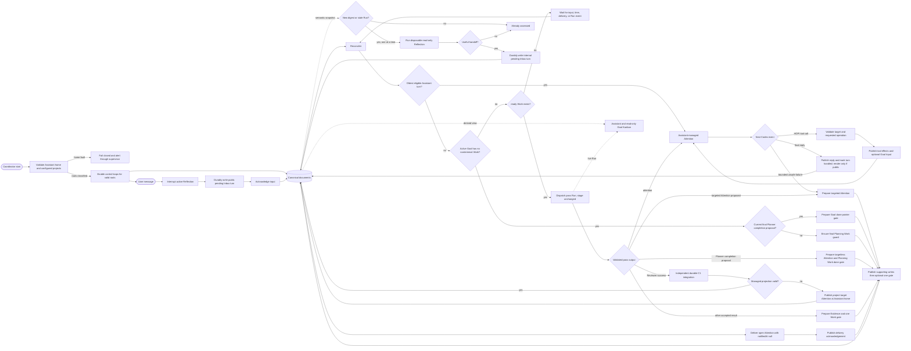
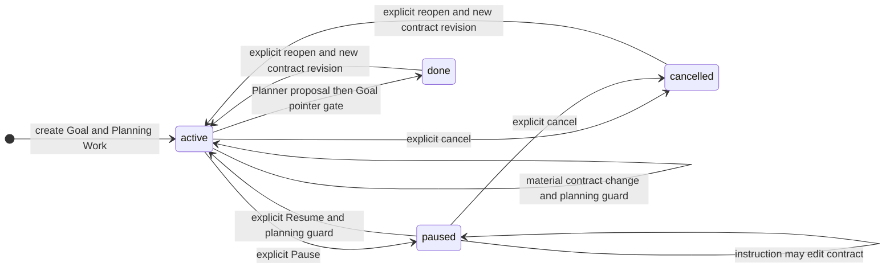
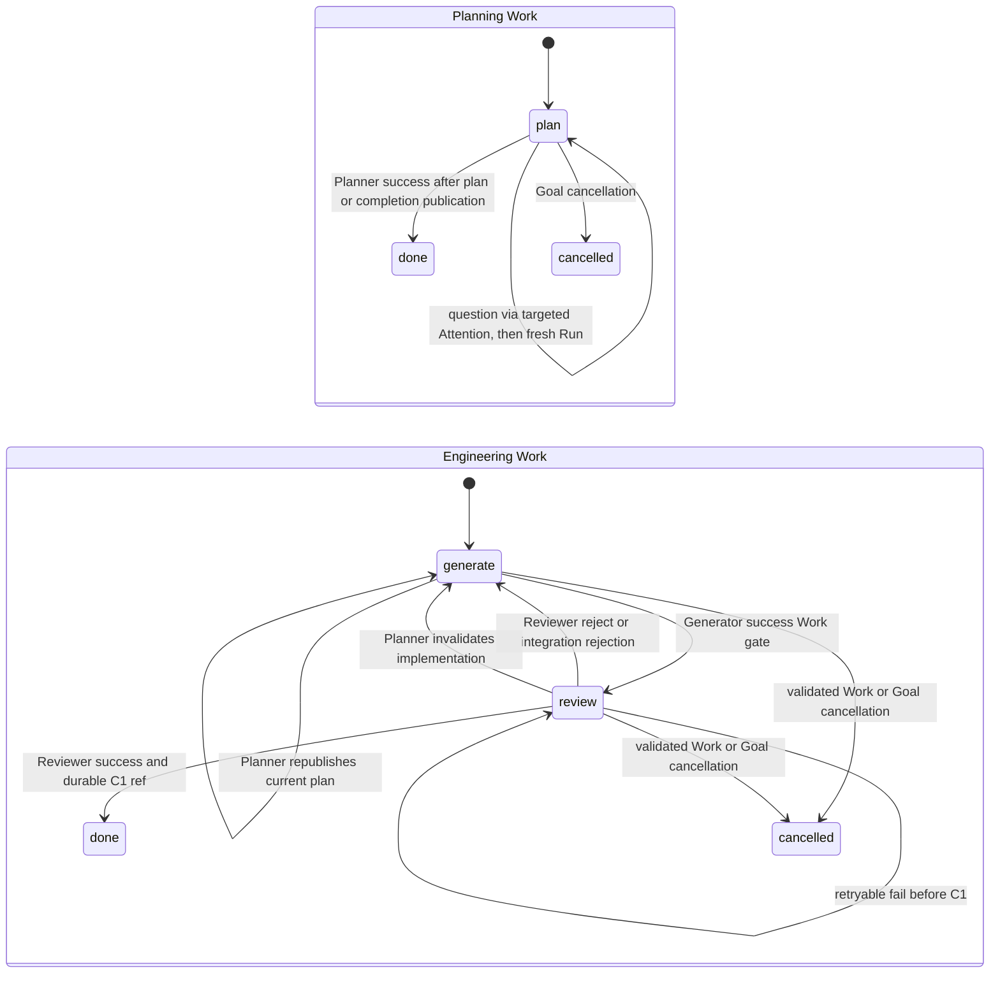

# HOPI MVP State Machine

Status: accepted derived reference
Last updated: 2026-07-11

This document visualizes the lifecycle rules accepted in [the MVP design](./mvp_design.md). It is
not a second source of truth. Schemas belong to [the document model](./mvp_document_model.md),
Assistant behavior to [the Assistant design](./mvp_assistant.md), execution behavior to
[the execution design](./mvp_execution.md), and publication mechanics to
[the publish protocol ADR](./mvp_publish_protocol.md).

## Product and Durable State

The operator-facing product has **Assistant**, **Project**, and **Goal**. Project is stable context
without a workflow lifecycle. Attention is an internal control document. Targeted Attention appears
as internal **Waiting for Assistant** state and blocks its target; targetless Attention appears as a normal
Goal completion update. It is not another product concept.

Five internal document types have these minimal durable control fields:

| Entity | Durable discriminator | Values |
| --- | --- | --- |
| Goal | `lifecycle` | `active \| paused \| done \| cancelled` |
| Planning Work | `stage` | `plan \| done \| cancelled` |
| Engineering Work | `stage` | `generate \| review \| done \| cancelled` |
| Attention | `resolvedAt` | `null` while open; timestamp when resolved |
| Inbox turn | `status` | `pending \| handled` |

Work also stores `kind`, permanent `dependsOn`, `notBefore`, `contractRevision`, top-level
`attempts: 0`, and append-only `evidenceRefs`; Engineering Work additionally stores its non-empty
Repo workspace. Failure context is read from referenced immutable Evidence. These are control facts,
not additional states. A Run, process, lease, Repo projection, root eligibility, and Kanban badge are
runtime facts or derived projections. `running`, `queued`, `scheduled`, and `waiting` are not Work
stages.

Run records and processes are disposable, but a `runId` is never reused within its Work. Evidence
and Git may retain qualified producer identity `(projectId, goalId, workId, runId)` after runtime
cleanup.

Inbox `source: user | reflection` and `visibility: public | internal` are provenance and projection
facts, not more status values. Reflection itself has no canonical lifecycle. Its runtime manifest is
disposable; only a useful internal brief enters the ordinary Inbox state machine.

Pass results are `success | reject | attention | fail`. Prose explains a result but cannot invent a
transition. A tool error observed by Coordinator is `fail`. If the Coordinator or runner process
disappears before a Work gate is published, no result is consumed and `attempts` may remain
unchanged.

Stable identity is explicit: event `(homeId, eventId)`, Goal `(projectId, goalId)`, Work
`(projectId, goalId, workId)`, producer Run `(projectId, goalId, workId, runId)`, Goal-local
Attention `(projectId, goalId, attentionId)`, and workspace Attention `(homeId, attentionId)`.
Each Assistant-home project link retains expected `{ projectId, primaryRepoId, repos,
codingDefaults? }`, where every Repo owns a stable ID and local path.
`codingDefaults` selects defaults for future responsibility Runs but is not lifecycle state. The
selected user checkout locates the Repo but is never a canonical root. Coordinator derives a stable
managed integration worktree on `hopi/release` for every Repo; a missing, corrupt, or divergent
Project release projection is blocked under the expected identity.

## Publication Boundary

All canonical mutations use `publish(bundle)` under one Coordinator and one global publication
mutex. One ordinary publication changes exactly one storage root and has one shape:

```text
validate complete candidate -> supporting writes -> optional single domain gate
```

Supporting writes may include documents, source checkpoints, artifacts, and Evidence. A domain
gate is one authoritative write that changes eligibility or claims consumption or completion, such
as an Inbox `handled` update, Goal Input receipt, Planning Work guard, Work transition, Attention
resolution, or Goal terminal transition. If an operation needs more than one gate or storage root,
Coordinator splits it into ordered publications. A process stop may leave an earlier publication
complete, but never makes a later gate appear first.

`C1` integration is an independent Git operation rather than an ordinary multi-file publication.
Its guarded target-ref move is the single irreversible gate, and integration is reported successful
only after that ref is durable. Implementation ordering, atomic file replacement, and Git mechanics
are specified only in the publish protocol ADR.

The ordinary document protocol targets process-crash recovery, not general power-loss durability.
Two boundaries are stronger:

- an Inbox turn is durably stored before HOPI acknowledges receipt to its sender
- `C1` objects and target ref are durable before integration is reported complete

Model calls, pass Runs, tests, and task-worktree edits happen outside the mutex. Snapshot capture
and publication are serialized, not execution. A mutating HOPI tool uses ordered idempotent
project effects and Goal Input, then the final Codex reply handles the Assistant-home turn.

Each pass receives a staged immutable context bundle from the current managed root. The task
worktree may not contain later uncheckpointed canonical documents; its source checkout is never
used as workflow authority. Returning output must still pass the current canonical guards.

Before enabling Inbox, reconciliation, delivery, or dispatch, Coordinator validates Assistant home
and every configured project. It discards stale runtime leases and reruns unconsumed work rather
than attaching old processes. An ambiguous or unwritable project gets one open project-target
Attention in Assistant home and remains unscheduled. If Assistant home itself cannot be validated
or written, startup fails closed and an external supervisor alerts the operator.

If a durable C1 ref exists but the HOPI-managed integration projection is missing, partial, or
inconsistent, HOPI creates or reuses project-target Attention and keeps the Project unscheduled.
Managed ownership does not make canonical documents disposable, so the MVP performs no destructive
repair. The user checkout is outside this validation and is never touched.

## Internal Attention

Attention has no `kind`, `status`, or stored scope:

| Field | Meaning |
| --- | --- |
| `target` | One canonical reference, or `null` for Goal completion |
| `resolvedAt` | `null` while open; resolution time otherwise |
| `notifiedAt` | Webhook or Attention-linked public Assistant delivery acknowledgement, otherwise `null` |

Storage path derives scope. Goal-local Attention may target only its owning Goal or Work, or use
`target: null` for that Goal's completion. Workspace Attention may target an Inbox event or linked
project. Delivery identity is `(projectId, goalId, attentionId)` for Goal-local Attention and
`(homeId, attentionId)` for workspace Attention.

Every open Attention with a non-null target has exactly the same kernel behavior:

- it appears as **Waiting for Assistant**
- it blocks its target and deterministic descendants
- it remains open after notification
- it resolves only after an answer or verified condition change

A project target covers its Goals and Work; a Goal target covers its Work; a Work or event target
covers only that object. One condition spanning unrelated roots creates one Attention per root.
Target is immutable; a condition moving to another target resolves the old document and creates a
new one.

Open Goal-local Attention with `target: null` is a non-blocking completion proposal. It becomes a
deliverable completion update only when its Goal is `done` and points to it, and resolves when
delivery is acknowledged. A Goal has at most one open targetless Attention not yet claimed by
`completionAttentionId`.

`notifiedAt` records delivery, not resolution. The operator-visible message is immutable after its
first delivery attempt; a materially different message uses a new Attention ID. Delivery remains
at-least-once, so a process stop after transport acknowledgement but before the document update may
repeat the same Attention ID.

## Complete Control Loop



An ordinary conversational turn may publish only its final reply and `handled` gate. Each mutating
HOPI tool separately validates its named target, publishes operation-specific project effects, and
uses qualified Goal Input as the effect receipt. A single turn may call tools for multiple Goals;
selected page context creates no transition.

A Goal-local answer tool publishes Project effects and Goal Input before resolving Attention, then
Codex continues the same conversation turn. An answer to event-target Workspace Attention resolves
that guard and handles only the answer turn; the original turn remains pending and runs again with
the answer visible in durable conversation history. Project-target Attention resolves only after
deterministic repair validation. A process stop therefore leaves a guard open or a turn pending
rather than requiring a hidden continuation state.

Tool effects are idempotent by qualified source turn `(homeId, eventId)`, target identity, current
canonical guards, and expected content. Matching Goal Input proves that Goal accepted the source
turn. A Goal/Input mismatch creates project-target or event-target Attention instead of a guessed
repair.

Public user turns are selected before internal Reflection turns, with receipt order preserved within
each class. Reflection never enters the publication path directly. Its one optional brief is ordinary
pending Inbox input to the speaking thread, which rereads current truth before choosing any HOPI tool.
A hidden internal turn remains absent from the conversation projection unless the speaking thread
explicitly promotes it for operator notification.

## Reflection Runtime Lifecycle

```mermaid
stateDiagram-v2
    [*] --> Baseline : first non-urgent semantic snapshot
    [*] --> Running : first snapshot has urgent signal
    Baseline --> Deferred : digest changed; automatic progress remains
    Baseline --> Running : urgent signal or settled changed snapshot
    Deferred --> Deferred : newer automatic progress coalesces
    Deferred --> Running : urgent signal or quiescent idle tick
    Running --> Assessed : no handoff
    Running --> HandedOff : one internal brief
    Running --> Interrupted : public user input
    Assessed --> Deferred : later digest; automatic progress remains
    Assessed --> Running : later eligible digest
    HandedOff --> Deferred : later automatic progress
    HandedOff --> Running : later eligible digest after speaking-thread effects
    Interrupted --> Deferred : fresh post-user automatic progress
    Interrupted --> Running : fresh post-user eligible snapshot
    Running --> Running : newer state coalesces
```



`Baseline`, `Deferred`, `Running`, `Assessed`, `HandedOff`, and `Interrupted` are explanatory runtime labels only.
They are not stored workflow states, Kanban columns, or scheduling guards. At most one Reflection is
running; a newer snapshot replaces queued older snapshots. A quiescent idle tick begins and ends
without an active responsibility Run, so a Run completion racing an older scan cannot prematurely
settle Reflection. Deferred means only that HOPI can still make deterministic progress; it creates no
timer, queue record, or canonical field. A user
interruption does not mark the digest assessed. All other completed assessments suppress repetition
for that digest, and bounded internal handoffs prevent self-triggering loops.

## Goal Lifecycle



Material objective, scope, constraint, non-goal, success-criterion, or behavior-changing decision
changes increment `contractRevision`. Resume preserves the revision unless its instruction changes
the contract. Reopen always increments it and ensures new Planning Work.

Goal lifecycle is both an admission guard and a Run-lease guard. Once a Goal leaves `active`,
Coordinator aborts every live Run for that Goal before doing more Goal work; Runs owned by other
Goals are unaffected. Pause therefore prevents new dispatch, interrupts admitted Runs, and rejects
any racing result publication or integration. An interrupted Run may leave useful isolated source
or diagnostics but cannot advance Work. Cancel installs the same guard first, then cancels
nonterminal Work without reverting integrated history.

Planner owns semantic completion assessment. In a final Planning publication it either creates
more Engineering Work, requests operator input, or writes the Goal's one open unclaimed targetless
Attention as support before marking Planning Work `done`. The proposal contains the completion
summary and links to existing proof; its ID is not derived from a content digest.

Coordinator owns only the lifecycle transition. With that durable proposal, no nonterminal Work,
no covering targeted Attention, and valid C1 structure, it publishes Goal `lifecycle: done` plus
`completionAttentionId` as the single completion gate. An accepted instruction that changes the
contract or requires new Planning must first resolve the unclaimed proposal as superseded. A
process stop before the Planning gate causes Planner to reassess; a stop after it lets Coordinator
finish without another semantic model call. Reopen resolves the referenced completion and clears
the pointer before new planning.

## Planning Guard

Each Goal has at most one nonterminal Planning Work (`kind: planning`, `stage: plan`). A planning
trigger creates or reuses that Work as a single Goal-wide guard. No Engineering Work in the Goal may
dispatch, publish a returning result, or enter `C1` while the guard exists. Planning Work is never
added to Engineering `dependsOn`.

Planner reads current Goal, Inputs, design, Work, and Evidence to determine why planning is needed;
the Work stores no separate trigger pointer. While Planning Work remains the guard, Planner
publishes prerequisite Engineering Work before dependents plus the remaining design and supporting
documents. Planning Work `done` is the final gate that removes the Goal-wide guard and exposes
either the validated engineering plan to readiness or a final completion proposal to Coordinator.

Before interpreting the requirement, Planner reads root `AGENTS.md`. If it is absent, Planner
silently explores the Repo and includes a concise bootstrap `AGENTS.md` among its supporting writes.
This adds no initialization task, Work stage, readiness predicate, or gate; the same Planner Run
continues into clarification and planning.

For a user-originated delivery requirement, Planner asks a question only when its answer could
materially change the contract, design, acceptance criteria, or Work decomposition. Established
decisions are written into `design/**` during that loop. A question creates targeted Attention and
leaves Planning Work at `plan`; its answer causes a fresh Planner Run. A clear requirement may plan
immediately. Once no material question remains, current documents authorize Planner success
without explicit operator approval. Clarification therefore adds no Work stage, approval field, or
separate state machine.

Assistant handles ordinary conversational ambiguity and chooses whether to call a HOPI tool. After
it requests Planning for a Goal, Planner exclusively owns delivery-requirement clarification.

A user instruction to modify HOPI design documents is interpreted by the model like any other
Input. A design-file write does not mechanically trigger a revision, Planning Work, invalidation,
or code change; the model proposes those effects only when the instruction and current Goal require
them.

For an Engineering `attention` result, available Evidence and one targeted Attention are published
without a Work gate. Speaking Assistant decides whether current authority answers it, Planning is
needed, or the operator must decide. There is no direct responsibility-to-responsibility handoff.

Planning triggers include Goal creation, material contract change, resume, reopen, stale output,
explicit Assistant-requested planning and an active Goal with neither nonterminal Work nor a
current completion proposal. An interrupted Planner simply runs again while its Planning Work
remains at `plan`.

## Work Lifecycle



Dispatch never changes stage. Responsibility is a pure function of Work kind and stage:

| Pass | Stage | Accepted result and effect |
| --- | --- | --- |
| Planner | `plan` | `success -> done`; `fail -> retry` |
| Generator | `generate` | `success -> review`; `attention -> Assistant`; `fail -> retry` |
| Reviewer | `review` | success -> C1; reject -> generate; attention -> Assistant; fail -> retry |

After every Generator Run, Coordinator may create a task-branch source savepoint. The savepoint has
no state-machine meaning and may preserve partial output from any result. Artifacts and Evidence are
supporting writes. One Work-file update is the result gate for ordinary outcomes; `attention`
instead publishes Evidence plus one targeted Attention without changing Work. Ordinary gates append relevant
`evidenceRefs`, changes stage if required, and increments top-level `attempts` for `fail`, `reject`,
or deterministic pre-C1 rejection. If that Work gate is absent after a process stop, the result was
not consumed. Evidence alone remains provenance and does not prevent a new Run.

If a pass returns `fail` and cannot continue without operator authority or an external operator
action, Coordinator may publish its targeted Attention rather than a Work-result gate. No other
result may carry targeted Attention. Technical failures in Git, sandbox, ports, or optional tools
remain diagnostics and bounded recovery unless an exact user-owned action remains. Attention blocks
the Work or Goal until resolved; after resolution Reconciler starts a new Run instead of applying the
old result. A process stop may therefore undercount an attempted Run, which the MVP accepts instead
of adding a result ledger.

Every returning result must still pass Goal lifecycle, Work stage, contract revision, permanent
dependencies, targeted Attention, selected canonical guard hashes, and current integration checks.
Stale output may remain Evidence but cannot advance Work. A Planning Work created after an
Engineering Run started is an admission barrier, not by itself a stale condition: its Planner Run
waits for admitted same-Goal Engineering Runs to drain, while new Engineering dispatch is blocked.

An unrelated C1 target advance alone does not stale an Engineering result. Planner remains tied to
its staged target snapshot; Generator and Reviewer remain valid while their selected semantic guards
are unchanged, and C1 owns deterministic rebuild or source conflict handling.

Reviewer is the last model pass. On success, Coordinator performs independent deterministic `C1`
integration. `C1` contains source and ordinary document changes, integration Evidence, and the Work
at `done` with its Evidence references. A guarded ref move observed at C1 is the irreversible
completion gate on HOPI-owned `hopi/release`; success is reported only after durability is
confirmed. Work stores no integration-commit field. An update error may return Work to `generate`
or increment `attempts` only when the ref is verified at its old value. A ref at C1 means Work is
done and never retries. A missing or inconsistent managed integration worktree blocks the Project;
the MVP does not reconstruct it or repair paths automatically. User checkouts are never
materialized, validated, or repaired. Detailed Git mechanics belong only to the publish protocol
ADR.

If another independently ordered C1 advances `hopi/release` after Reviewer staging, Coordinator
rebuilds the candidate on that target. A clean merge completes directly; a mechanical conflict is a
normal pre-boundary rejection. Neither case adds a stale-target state.

Cancellation is publishable only if every nonterminal dependent is cancelled transitively before
its prerequisite. If that cascade is not clearly intended, targeted Attention requests operator
input. Planner may create replacement Work but never removes or rewrites historical dependency
edges.

## Readiness

The Reconciler dispatches Work exactly when this conjunction is true:

```text
ready(work) :=
  work.stage is nonterminal
  and goal(work).lifecycle == active
  and the Goal package and permanent dependency DAG are valid
  and work.contractRevision == goal(work).contractRevision
  and (work.kind == planning or goal(work) has no nonterminal Planning Work)
  and every work.dependsOn item is done
  and (work.notBefore is null or work.notBefore <= now)
  and work.attempts < profile.maxAttempts
  and no open targeted Attention covers its project, Goal, or Work
  and no active Run owns the Work lease
  and capacity exists for pass(work.kind, work.stage)
```

A false predicate leaves stage unchanged. A nonterminal Planning Work keeps all Engineering Work in
that Goal ineligible. Capacity, leases, time, and project-root eligibility remain runtime concerns.
An active Goal with no nonterminal Work completes only from a current final Planner proposal;
otherwise Reconciler ensures Planning Work for semantic assessment.

If `attempts >= maxAttempts`, Work is never ready. Reconciler creates or reuses targeted Attention
before considering it again, so an incomplete notification publication cannot make exhausted Work
runnable.

## Retry and Process Restart

- `attempts` starts at zero. A consumed `fail`, `reject`, or deterministic pre-C1 rejection
  increments it through the Work gate. Ordinary success does not clear it.
- A material contract revision, a materially changed Planner publication, or a verified explicit
  retry resets `attempts` to zero. A delayed retry sets `notBefore`.
- A runner or Coordinator stop before the Work gate may leave source or Evidence but does not
  consume the result and may not increment `attempts`. Restart releases the stale lease and starts a
  new Run when readiness allows; it never reattaches the old child process.
- `attention` leaves Work stage and attempts unchanged. Speaking Assistant may request Planning;
  reconciliation uses ordinary readiness plus Planning and Attention guards.
- Targeted Attention remains the only durable operator block. It stays open until answered or its
  condition is verified clear, after which Reconciler starts fresh work.
- Startup validates every root before enabling control loops. Ambiguous project truth creates or
  reuses project-target Attention; invalid Assistant-home truth fails closed to the supervisor.
- Ordinary documents provide process-crash recovery. Durable Inbox acknowledgement and the `C1`
  ref are the two stronger persistence boundaries. Any inconsistent managed projection blocks the
  Project without touching a user checkout.

## Derived Goal Kanban

Goal Kanban is a retained product view, not a diagnostic state machine. Its four active columns are
direct projections of Work kind and stage:

| Column | Cards |
| --- | --- |
| `Plan` | Planning Work at `plan` |
| `Build` | Engineering Work at `generate` |
| `Review` | Engineering Work at `review` |
| `Done` | Work at `done` |

Cancelled Work is hidden by default and available through a **Show cancelled** archive filter. It
is not an active workflow column.

Each nonterminal card shows exactly one primary badge, chosen by this priority:

| Badge | Derivation |
| --- | --- |
| `Waiting for Assistant` | Open targeted Attention covers the Work or Goal |
| `working` | A live Run owns the Work lease |
| `scheduled` | Nonterminal Work has a future `notBefore` |
| `queued` | `ready(work)` and no live Run |
| `waiting` | A non-stage readiness predicate is false |

The first matching badge wins, so cards do not accumulate competing status labels. Terminal and
cancelled cards receive no readiness badge. The board is read-only: no drag operation edits stage,
dependencies, priority, or lifecycle. Assistant conversation is the general control entry;
explicit **Pause** and **Resume** remain available on Goal. A separate Diagnostics surface is
deferred beyond MVP.

P2 Preview adds no canonical state. Coordinator starts the reviewed primary Project adapter against
the complete managed `hopi/release` Repo projection and keeps its process, logs, health, and endpoint
in disposable runtime storage. Unintegrated Work worktrees and user checkouts are not Preview inputs. A
missing or failed adapter produces a local prompt; operator confirmation sends an ordinary
Assistant turn. Codex reuses current Preview setup Work when it exists or calls its Planning tool
for a repair; it does not mutate Kanban directly. The shared `scripts/hopi/prepare` contract owns
prerequisites from a clean managed integration worktree and `scripts/hopi/preview` owns startup, so
missing dependencies are a failed Project contract rather than an operator setup step. Preview has
one readiness transition: `starting -> running` only when the Preview adapter emits
`HOPI_PREVIEW_URL=<reachable-url>`; exit or bounded timeout before that becomes `failed` and routes
the captured logs through the same repair prompt. Operator Stop moves `starting|running -> stopped`.
A successfully advanced or recovered C1 ref moves `starting|running -> stopped` with runtime reason
`release_updated` and clears the endpoint; it never auto-restarts Preview or changes the durable C1
outcome. Other state and document changes do not participate in this runtime transition.

## Core Invariants

- Canonical documents are the sole durable product truth; runtime indexes, leases, Runs, and Kanban
  badges rebuild from them.
- An MVP Project contains one primary Repo and zero or more secondary Repos. The primary managed
  worktree owns canonical documents and the single C1; every managed Repo materializes the release
  recorded by that C1. User checkouts are outside publication and repair. Missing primary root
  `AGENTS.md` is Planner context bootstrap, not a lifecycle state or initialization Work.
- A Project may bootstrap one reviewed `scripts/hopi/prepare` through its first real Engineering
  Work. Coordinator runs it repeatedly before consuming a checkout; there is no initialized or
  prepare-stale state. Reviewer always starts from a clean task-branch checkpoint, never from
  uncheckpointed Run residue.
- User-checkout code enters only from an explicitly named committed ref through ordinary Input,
  Planning, Engineering Work, Review, and C1. Uncommitted content is never imported.
- One Coordinator publishes canonical changes under one global mutex. An ordinary publication has
  supporting writes and at most one domain gate; multiple gates or roots use ordered publications.
- Ordinary publication promises process-crash recovery. Input acknowledgement waits for a durable
  Inbox turn, and successful integration waits for a durable `C1` target ref.
- A Goal has at most one Planning Work at `plan`. While it exists, no Engineering Work in that Goal
  may dispatch, publish a returning result, or enter `C1`. Planning Work never appears in
  Engineering `dependsOn`.
- Attention has no kind, status, or stored scope. `resolvedAt: null` alone means open. An open
  non-null target always blocks and appears as **Waiting for Assistant**; a null target is Goal completion and
  never blocks.
- An event-target Workspace answer closes that guard and leaves the older event pending for a fresh
  canonical-context run; Goal-local answers publish Input before resolution.
- A Goal Input must match its qualified source Inbox turn and digest. One turn may have Inputs in
  multiple Goals only through explicit successful HOPI tool calls.
- A home project link retains the expected project ID used for validation and project-target
  Attention when the linked package is unreadable.
- Terminal Goal and Work state cannot be overwritten by an old Run.
- `dependsOn` is permanent and is the only execution-order and conflict-avoidance DAG between
  Engineering Work. Cancelling a prerequisite first cancels every nonterminal dependent.
- `completionAttentionId` is present exactly while Goal lifecycle is `done`. Only final Planner
  success may create the Goal's one open unclaimed targetless completion proposal; Coordinator may
  only claim it after structural guards pass. Completion creates no second document or
  content-derived identity.
- A Work result is consumed only by its owning Work gate for ordinary outcomes. An `attention`
  outcome instead publishes Evidence plus the targeted Attention and leaves Work unchanged;
  Evidence without a Work gate remains provenance and permits a new Run after resolution.
- `work.attempts >= profile.maxAttempts` is never ready and gains targeted Attention.
- An Engineering Work's integration commit is the unique reachable durable-ref `C1` carrying its
  qualified Work trailer; the same tree contains Work `done` and its Evidence references.
- Any post-C1 managed projection anomaly creates project-target Attention and keeps the Project
  unscheduled. HOPI never repairs individual paths or touches a user checkout.
- Goal Kanban columns, the cancelled archive filter, and the single primary badge are read-only
  projections and own no transition.
